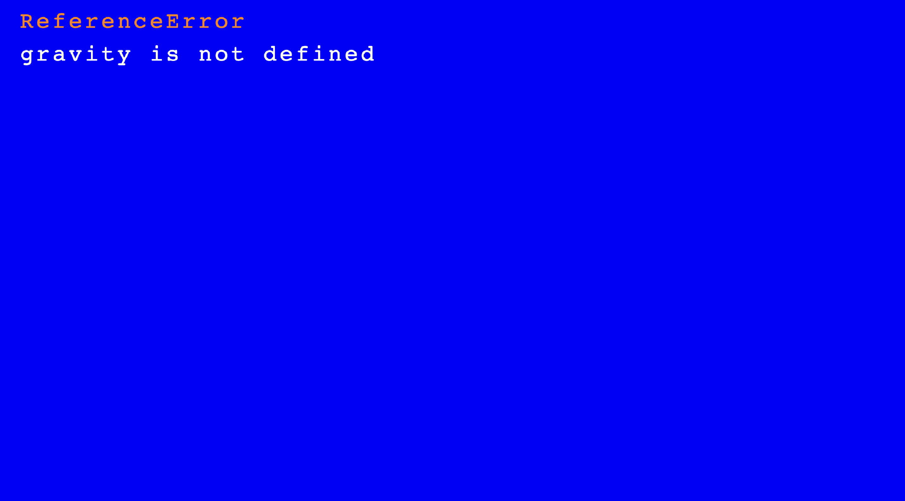

# Entry 4
##### 3/19/2023
These past few weeks have been hard for me because I was doing pretty good with my FP(freedom project). But then my whole IDE just got wiped out and all of my files got deleted. My SEP project and homework were saved because they were on GitHub, but not my FP so then I had to restart. I had some code because of my and Jadien talking to each other about how we wanted the project to be but not much. So I just copy-pasted that code and I got this.  I was confused when I got this because this never happened before. If I had an error it would pop up in the console but doesn't turn my screen blue. I thought maybe I wrote it wrong and went to the [kaboom](https://kaboomjs.com/) website and saw that they used the same ``gravity()`` syntax and I spent maybe over an hour thinking what was wrong I removed the ``gravity`` and added some other code and the same thing happened where I couldn't add my code in without the blue error screen popping up. Then I read something on the top of the website and it said it updated. On the top of the website it says that "Kaboom v3000.0 beta released Checkout [this article](https://3000.kaboomjs.com/blog/3000) for more info, View v3000 doc / examples here"  So all that for nothing, but it is what it is and I went to the updated kaboom and relearn some stuff. So ``gravity()`` turned into [``setGravity()``](https://3000.kaboomjs.com/). Most of the code still works so I don't have to change much. Most of my images were downloaded on my macbook so all that is fine. So to sum it up what I have done was remaking my project.   

## Skills
The skills I worked on were embracing failure and a growth mindset. This is because I had to have the patience to code for a long period and try to solve a problem. I failed to see that kaboom updated, and time and time again I failed to try to rebuild my project.

## EDP
In the Engineering Design Process Im in the middle of testing and evaluating the prototype and improving as needed. I need more testing because their is a lot of stuff I need to add and those often come with a lot of bugs and errors. Also because of kaboom being updated I had to change some stuff up. For example just like what I said in the blog  ``gravity()`` got changed into "setGravity()".

[Previous](entry03.md) | [Next](entry05.md)

[Home](../README.md)
